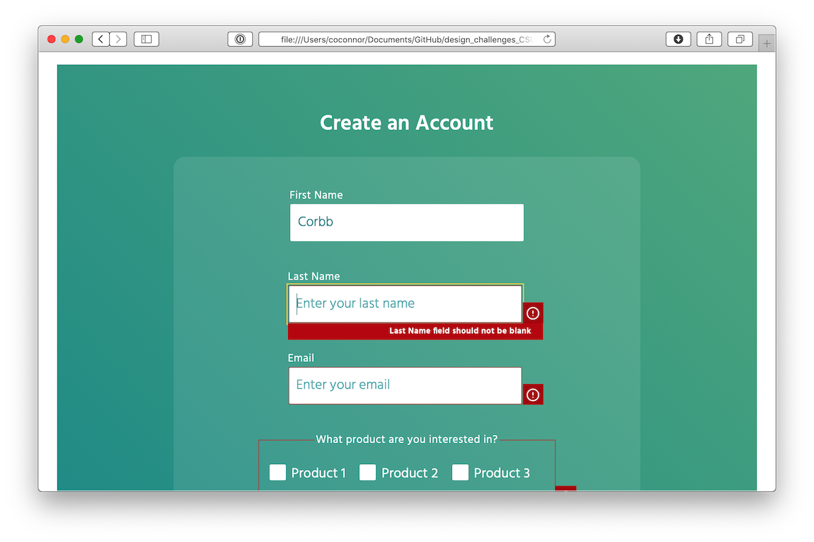

@title[Robust, Semantic Solutions to Modern Design Challenges]

## Robust, Semantic Solutions to Modern Design Challenges

Corbb O'Connor<br>
Christina Adams

@snap[south span-50]
http://bit.ly/robust19slides
@snapend

+++
## The Conundrum
@ul
- Modern design relies upon *cutting edge* technology
- Good accessibility relies upon *well-adopted* technology
@ulend
+++
@snap[midpoint span-100]
@css[size-15](**When you, an accessibility professional, are handed a modern, minimalistic design…**)
@snapend
+++?color=darkblue
## The Blog Post

+++
@title[The Blog Post - Order]
@snap[east span-75]

@snapend

@snap[north-west span-15 text-08]
##### Likely
@ol[](false)
- Image
- Category
- Date
- Headline
- Description
- @fa[arrow-right]()
@olend
@snapend

@snap[south-west span-15 text-08]
##### Better
@ol
- Headline
- Image
- Category
- Date
- Description
- @fa[arrow-right]()
@olend
@snapend

+++
@title[The Blog Post - Code]

```html
<a class="site-card" href="/">
  <div class="blog_header">
    <h2>Top 5 Winter Adventures…</h2>
    
    <span>Winter Adventures</span>
    <span>1/30/2019</span>
  </div>
  <p>It is easy to give into hibernation every winter but…</p>
  <span>
    <svg version="1.1" xmlns="http://www.w3.org/2000/svg" width="24" height="24" viewBox="0 0 24 24" role="image">
      <title>Read more</title>
      <desc>Top 5 Winter Adventures…</desc>
      </svg>
  </span>
</a>
```

@[1,15](One, big link.)
@[2-8](Order we want elements to be encountered.)
@[9-15](Add the SVG.)
@[1-15]

+++
@title[The Blog Post - CSS]
```css
.blog {
  display: flex;
  flex-direction: row;
}
.blog .blog_header {
  display: flex;
  flex-direction: column;
}
.blog .blog_headline{
  order: 1;
}
.blog .blog_image {
  order: -1;
}
```
@[1-4](This containing `<div>` has `display: flex`.)
@[5-8](`Flex-direction` set to `column` so elements will stack at any viewport.)
@[9-14](Here is the real magic on how we achieved the `order`.)
@[1-14]
+++
## The Blog Post


+++?color=darkblue
## Shopping Cart


+++?color=darkblue
## Progress Bar


@ul
- Breadcrumb…what?
- A list of steps in which order matters
- Hey, look, non-text content!
@ulend
+++
```html
<div role="navigation">
  <h2 class="sr-only" id="yp">Your Progress</h2>
  <div class="progress-bar">
    <div role="progressbar" aria-valuenow="25" aria-valuemin="0"
      aria-valuemax="100" aria-valuetext="25%">25%</div>
  </div>
  <div class="progress-indicators" aria-hidden="true">...</div>
```
@[1-2](Inform users the following communicates their progress.)
@[3-6](Use `role="progressbar"` to give a high-level overview of progress.)
@[7](These are the circles/checkmarks, hidden on purpose.)


+++
```html
  <ol class="progress-labels">
    <li>
      <button>
        <span class="sr-only">Step 1: </span>
        Billing Address
        <span class="sr-only">, Complete</span>
      </button>
    </li>
  </ol>
</div>
```
@[1-3](Ordered list of buttons.)
@[4-6](Notice the spaces after the `<span class+sr-only">`.)
@[1-10]()


+++?color=darkblue
## Prices

- Heading level 2 Your Order
- Product Brand
- Product Name
- $22.99
- $59.99
- Subtotal
- ...

+++?image=images/prices.png&position=right&size=50%
@snap[west span-35 text-07]
@ul[](false)
- The current price is not always the cheapest.
- [G117: Using text to convey information that is conveyed by variations in presentation of text](https://www.w3.org/TR/WCAG20-TECHS/G117.html)
@ulend
@snapend
+++
```html
<span class="product_price">
  <span class="price strike-through">
    <span class="sr-only">Original Price: </span>
    $22.99
  </span>
  <span class="price">
    <span class="sr-only">Today's Price:</span> $59.99 
  </span>
</span>
```
@[2-5](Off-screen content used as a label.)
@[2-5](Again note the space.)
@[1-9]()

+++?color=darkblue

## Forms and Validation
@ul
- Basic, semantic structure is absolutely necessary.
- Do not rely on placeholder text. Use visible labels using `<label for="">` (and sometimes `<legend>` and `<fieldset>`).
- Consider error messaging as you design every form.
@ulend
+++
## Validaiton with ARIA
@ul[](false)
- Client-side validation and styling can easily be tied to ARIA attributes
@ulend            
```html
<label for="firstName">First Name</label>
<input id="firstName" aria-required="true" aria-invalid="false" 
  placeholder="">
```
```css
.form_example .form-item > input[aria-invalid=true], .form_example .form-item textarea[aria-invalid=true] {
  border: 1px solid #a50000;
}
```
+++

+++

+++

+++
```html
<div class="form-item">
  <label for="firstName">First Name</label>
  <input type="text" name="firstName" id="firstName" 
    aria-required="true" aria-invalid="true" placeholder="Enter your first name">
  <button type="button" class="error-button icon-alert-circle"
    aria-hidden="true" tabindex="-1"></button>
  <div class="error-message is-hidden">
    First Name field should not be blank
  </div>
</div>
```
@[5-6](Screen reader users will likely be confused by an accordion button on the form, so we hide it and remove from the tab order.)
@[7-9](Error message starts with the `is-hidden` class.)
+++
Label is showing:
```css
.form_example .error-message {
  font-size: .6em;
  padding: 5px 20px 5px 5px;
  width: calc(100% + 2.1em);
  left: auto;
  ...
}
```
Label is hiding:
```css
.form_example .error-message.is-hidden {
  line-height: 0px;
  font-size: 0px;
  padding: 0px;
  width: 1px;
  height: 1px;
  clip: rec(0, 0, 0, 0);
  left: -999em;
}
```
+++
```javascript
}).on('mouseenter', '.error-message', function() {
  $(this).removeClass('is-hidden');
}).on('mouseleave', '.error-message', function(){
  $(this).addClass('is-hidden');
```
@[1-4](…and do the same when the user's focus enters the `input` or when the user clicks on the `<button>` with the icon.)

+++?color=darkblue

## Search Field
@ul
- Heavy reliance upon placeholder text
- Submit button, **if present**, just has an icon
- For simplicity, we're going to assume search results are displayed on a new page
@ulend

+++

+++

+++

```html
<form>
  <input placeholder="Search">
  <i class="fa fa-search"></i>
</form>
```
@[2](No associated label.)
@[3](`<i>` tag for icon…really?!)
@[3](Icon is not natively clickable and it's missing a label.)
@[1-4](No obvious action.)
@snapend
+++
## Search Form - Solution
```html
<form action method>
  <div class="search">  
    <input type="text" id="siteSearch" placeholder="Search">
    <button type="submit">
      <span class="icon-search1"></span>
      <span class="sr-only">Search</span>
    </button>
  <label for="siteSearch" class="sr-only">Search:</label>
  </div>
</form>
```

```css
input:focus ~ label {
  // show the label, position left of its parent <div>
}
button:hover ~ label, button:focus ~ label {
  // show the label, position left of its parent <div>
}
```
+++?color=darkblue

## What We Covered
- Blog post
- Progress bar
- Shopping cart prices
- Form errors
- Search field with placeholder text

+++

## The Solutions
@ul
- Only one example used JavaScript
- Retained semantics
- Trailing and preceding spaces in `sr-only` to maintain readability on braille displays
- CSS: sibling selectors and modern display properties
    - + (adjacent sibling selector)
    - ~ (general sibling selector)
    - Flexbox (`display: flex` and `order: -1`)
@ulend

+++

## Final Considerations
@ul
- Browser compatibility needs
- One solution does not fit all scenarios
- Strongly suggest a discussion about **dissapearing labels**
@ulend

+++

## Fall Gracefully


+++

## Let's Connect

Corbb O'Connor<br>
cooc@siteimprove.com<br>
linkedin.com/in/corbb<br>

Christina Adams<br>
cada@siteimprove.com<br><br>
Github: http://bit.ly/robust19<br>
Slides: http://bit.ly/robust19slides